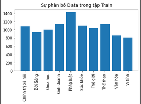
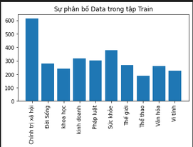
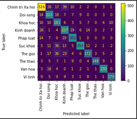
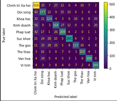

# Vietnamese-Text-classification-with-multilabel using KNN, SVM, Naive Bayes

Input: a text
Output: a Label (include ten Label)

## Report
|Full name|Role|
|:--:|:--:|
| Nguyen Hoang Long| Leader |
| Tran Duc Long| Member |

## Table of contents
1. [Introduction](#1-introduction)
2. [Dataset](#2-Dataset)
3. [Results](#5-results)
4. [References](#6-references)

## 1. Introduction
Throughout this work, there are many approach and we choose SVM, KNN, Bayes to compare the work performance. Firstly, we need to preprocessing data contain word segmentation, because we do this work with Vietnamese text so we don't need to bring that word to original. After preprocessing build SVM, KNN, Bayes Naive model to predict the labels.

## 2. Dataset
This Dataset we collected from https://github.com/duyvuleo/VNTC/tree/master/Data

about the Dataset
Sự Phân bố Data trong tập Train

Sự Phân bố Data trong tập Test

## 3. Results
Confustion matrix - Naive Bayes

Confustion maxtrix - KNN

Confustion maxtrix - SVM

## 4. References
Our work is inspired from:
[vietnamese-text-classification
](https://github.com/linhnvc/vietnamese-text-classification.git)
